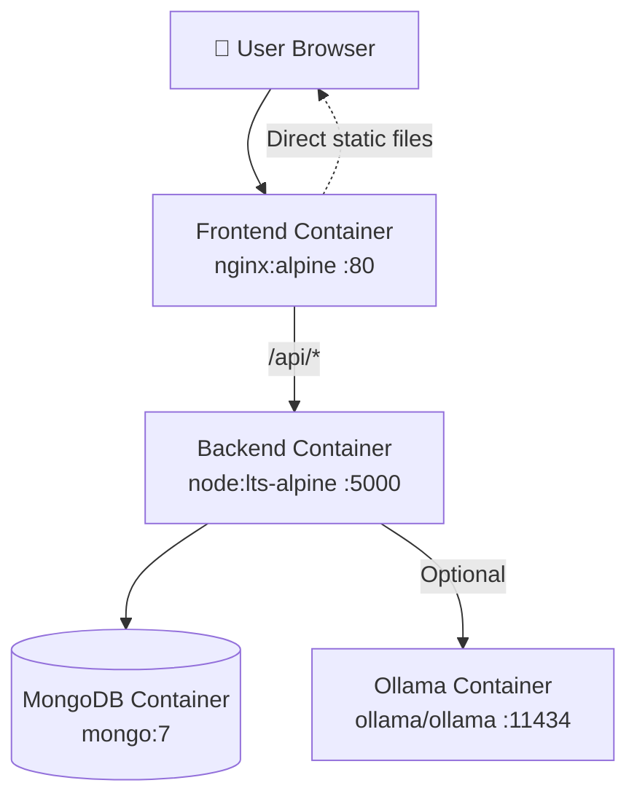
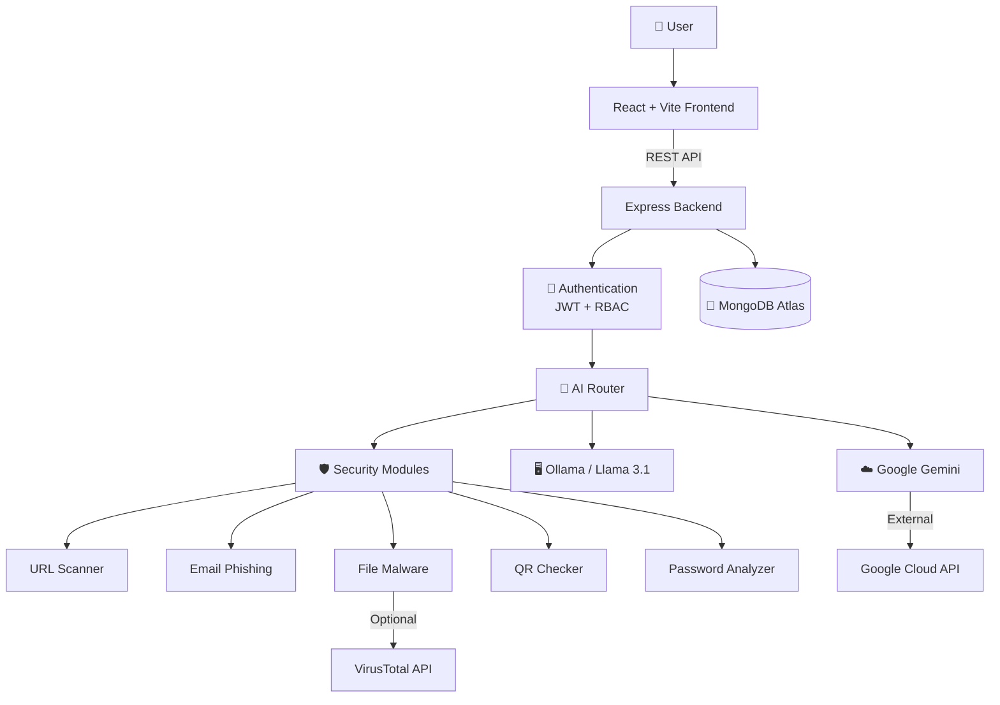

# 🛡️ Cyber Security Assistant


> Production-ready, AI-powered Cyber Security Assistant — full-stack (React + Vite / Node + Express / MongoDB Atlas) with JWT auth, 7 security modules, an AI chatbot with multimodal analysis, admin panel, and PDF reporting.

---

## 🐳 Docker Deployment

### Prerequisites
- Docker 24+
- Docker Compose 2.20+ (or Docker Desktop)
- At least 4GB RAM (8GB recommended for Ollama)
- 10GB free disk space

### Container Architecture



### Quick Start

1. Clone the repository and navigate to the project root
2. Copy environment files:
   ```bash
   cp backend/.env.example backend/.env
   cp frontend/.env.example frontend/.env
   ```
3. Edit `backend/.env` and set at least:
   - `JWT_SECRET` — a long random string
   - `JWT_REFRESH_SECRET` — another long random string
   - `GEMINI_API_KEY` — your Google Gemini key
   - `MONGO_ROOT_PASSWORD` — MongoDB root password (default: `admin123`)
4. Start the stack:
   ```bash
   docker compose up -d
   ```
5. Seed the admin user:
   ```bash
   docker compose exec backend npm run seed
   ```
6. Verify health:
   ```bash
   curl http://localhost/api/health
   ```

### Production Configuration

#### Environment Variables

All secrets are injected via environment variables. Never hardcode secrets in images.

| Variable | Description | Default |
|----------|-------------|---------|
| `JWT_SECRET` | JWT access token signing secret | *(required)* |
| `JWT_REFRESH_SECRET` | JWT refresh token signing secret | *(required)* |
| `GEMINI_API_KEY` | Google Gemini API key | *(required for AI)* |
| `CLIENT_ORIGIN` | Allowed CORS origin | `http://localhost` |
| `MONGO_ROOT_PASSWORD` | MongoDB root password | `admin123` |
| `ADMIN_EMAIL` | Bootstrap admin email | `admin@cybersec.io` |
| `ADMIN_PASSWORD` | Bootstrap admin password | `Admin@123456` |

### Docker Compose Commands

```bash
# Start all services in detached mode
docker compose up -d

# Build images after code changes
docker compose build

# View logs
docker compose logs -f

# View logs for a specific service
docker compose logs -f backend

# Stop all services (preserves data volumes)
docker compose down

# Stop and remove volumes (WARNING: deletes all data)
docker compose down -v

# Restart a specific service
docker compose restart backend
```

### Production Run

```bash
# Start with production environment
docker compose up -d

# Tail logs
docker compose logs -f --tail=100
```

### Development Run

For local development without Docker, see the [Installation](#-installation) section above.

To run the full stack with Docker during development:

```bash
# Start with live reload (requires volume mounts in docker-compose.override.yml)
docker compose up -d
```

### Image Details

| Service | Base Image | Exposed Port | Healthcheck |
|---------|-----------|--------------|-------------|
| Backend | `node:lts-alpine` | 5000 | `GET /api/health` |
| Frontend | `nginx:alpine` | 80 | `GET /` |
| MongoDB | `mongo:7` | 27017 | `mongosh ping` |
| Ollama | `ollama/ollama:latest` | 11434 | `ollama --version` |

### Troubleshooting

#### Backend won't start
- Check logs: `docker compose logs backend`
- Verify MongoDB is healthy: `docker compose ps mongodb`
- Ensure `JWT_SECRET` and `JWT_REFRESH_SECRET` are set

#### Frontend shows blank page
- Check nginx logs: `docker compose logs frontend`
- Verify backend healthcheck passes: `docker compose ps backend`
- Ensure `CLIENT_ORIGIN` matches the frontend URL in production

#### MongoDB connection refused
- Wait for MongoDB healthcheck to pass: `docker compose ps mongodb`
- Verify `MONGODB_URI` in backend `.env` uses Docker Compose service name (`mongodb`)
- Check credentials match `MONGO_INITDB_ROOT_USERNAME` / `MONGO_INITDB_ROOT_PASSWORD`

#### Ollama not responding
- Check health: `docker compose ps ollama`
- For GPU acceleration, uncomment the `deploy` section in `docker-compose.yml`
- Ensure sufficient RAM (4GB minimum, 8GB+ recommended)

---

## 📋 About The Project

The **Cyber Security Assistant** is a full-stack web application that combines traditional security scanning tools with advanced Artificial Intelligence to help users assess, detect, and mitigate cybersecurity threats. Built with **React + Vite** on the frontend and **Node.js + Express** on the backend, it integrates **Google Gemini** (cloud) and **Ollama** (local Llama 3.1) for AI-driven threat analysis, recommendations, and conversational security guidance.

**Key Capabilities:**
- 🔍 Scan URLs, passwords, emails, files, and QR codes for security threats
- 🤖 AI-powered security chatbot with multimodal file analysis (PDF, images, videos)
- 📊 Visual security reports with PDF export
- 🧠 Real-time threat intelligence via web search integration
- 🌐 Multilingual support (English, Tamil, Tanglish, Hindi)
- 🎤 Voice input and text-to-speech output
- 👑 Admin panel for user management and platform analytics

---

## ✨ Key Features

### Authentication & User Management
- Register, Login, Forgot/Reset Password, Email Verification
- JWT access + refresh tokens, httpOnly cookies
- Profile management with account statistics
- Admin panel for user management and platform analytics

### Security Modules
1. **URL Scanner** — HTTPS/SSL check, suspicious TLDs, URL shorteners, brand impersonation (typosquatting)
2. **Password Analyzer** — Shannon entropy, crack-time estimates, breach awareness, suggestions
3. **Email Phishing Detector** — heuristic scan + optional Gemini AI explanation
4. **File Malware Scanner** — SHA-256 + VirusTotal API
5. **AI Security Chatbot** — Gemini/Ollama multi-turn chat with multimodal analysis
6. **QR Code Safety Checker** — live camera decode (jsQR) + safety verdict
7. **Report Generator** — PDF export via PDFKit

### AI Chatbot Capabilities
- Text chat with Gemini and Ollama providers
- Multimodal file analysis (PDF, images, videos)
- Web search integration for threat intelligence
- Text-to-speech output
- Voice input support
- Markdown rendering with code blocks
- Security report visualization cards
- Copy / Listen / Regenerate message actions
- Chat history with session management
- Multilingual support (English, Tamil, Tanglish, Hindi)
- Prompt injection protection

---

## 🧱 System Architecture



---

## 🤖 AI Workflow

1. **User Input** — User sends a message or uploads a file in the AI Chatbot
2. **Input Sanitization** — Backend sanitizes the prompt, strips control characters, and detects potential prompt injection attempts
3. **AI Routing** — `aiRouter.js` decides between Gemini (cloud) and Ollama (local) based on message complexity
4. **Context Building** — Fetches recent scan history and relevant document chunks for context-aware responses
5. **AI Processing** — Selected provider generates a response with security analysis
6. **Response Formatting** — Markdown rendering, category detection, suggestions, and provider badges
7. **Multimodal Analysis** — For file uploads, runs visual/content analysis via Gemini Vision or fallback analyzer
8. **Report Generation** — Security report card with risk level, threats, confidence score, and PDF download
9. **Persistence** — Chat turns and analysis results are saved to MongoDB

---

## 🛠 Tech Stack

| Layer | Technology |
|-------|------------|
| **Frontend** | React 18, Vite, Tailwind CSS, Framer Motion, Chart.js, React Router |
| **Backend** | Node.js, Express, MVC, Mongoose, JWT, express-validator |
| **Database** | MongoDB Atlas |
| **AI** | Google Gemini (`@google/generative-ai`), Ollama (local Llama 3.1) |
| **Threat Intel** | VirusTotal API |
| **PDF** | jsPDF (frontend), PDFKit (backend) |
| **Auth** | JWT access + refresh tokens, httpOnly cookies, bcrypt |
| **Security** | Helmet, CORS, rate limiting, input validation, NoSQL sanitization, prompt injection detection |
| **Deploy** | Vercel (frontend), Render (backend), Docker optional |

---

## 📁 Project Structure

```
cs assistant/
├── backend/
│   ├── src/
│   │   ├── config/                 # Environment & database configuration
│   │   │   ├── index.js           # Central config loader
│   │   │   └── db.js              # MongoDB connection
│   │   ├── models/                 # Mongoose schemas
│   │   │   ├── User.js
│   │   │   ├── ScanHistory.js
│   │   │   ├── Report.js
│   │   │   ├── Notification.js
│   │   │   ├── ChatLog.js
│   │   │   ├── Document.js
│   │   │   ├── NoteChatLog.js
│   │   │   └── AttachmentAnalysis.js
│   │   ├── controllers/            # Request handlers
│   │   │   ├── authController.js
│   │   │   ├── scanController.js
│   │   │   ├── chatController.js
│   │   │   ├── adminController.js
│   │   │   ├── documentController.js
│   │   │   └── aiUploadController.js
│   │   ├── routes/                 # API route definitions
│   │   │   ├── authRoutes.js
│   │   │   ├── scanRoutes.js
│   │   │   ├── chatRoutes.js
│   │   │   ├── adminRoutes.js
│   │   │   ├── documentRoutes.js
│   │   │   └── aiUploadRoutes.js
│   │   ├── middleware/             # Express middleware
│   │   │   ├── auth.js
│   │   │   ├── validate.js
│   │   │   ├── rateLimiter.js
│   │   │   ├── sanitize.js
│   │   │   ├── upload.js
│   │   │   ├── errorHandler.js
│   │   │   └── languageDetector.js
│   │   ├── services/               # Business logic & external integrations
│   │   │   ├── security/
│   │   │   │   ├── urlScanner.js
│   │   │   │   ├── passwordAnalyzer.js
│   │   │   │   ├── emailPhishing.js
│   │   │   │   ├── fileScanner.js
│   │   │   │   ├── qrChecker.js
│   │   │   │   ├── qrDecoder.js
│   │   │   │   ├── gemini.js
│   │   │   │   └── reportGenerator.js
│   │   │   ├── ai/
│   │   │   │   ├── aiRouter.js
│   │   │   │   ├── ollamaService.js
│   │   │   │   └── multimodalAI.js
│   │   │   ├── search/
│   │   │   │   └── webSearchService.js
│   │   │   ├── scanService.js
│   │   │   ├── reportService.js
│   │   │   ├── documentService.js
│   │   │   ├── vectorStore/
│   │   │   │   └── vectorStore.js
│   │   │   └── fileAnalysisService.js
│   │   ├── utils/                  # Helpers & utilities
│   │   │   ├── logger.js
│   │   │   ├── jwt.js
│   │   │   ├── tokens.js
│   │   │   ├── email.js
│   │   │   ├── ApiError.js
│   │   │   ├── catchAsync.js
│   │   │   ├── seedAdmin.js
│   │   │   └── sanitizePrompt.js
│   │   ├── app.js                  # Express app assembly
│   │   └── server.js               # Entry point
│   ├── scripts/                    # Utility scripts
│   ├── .env.example
│   ├── Dockerfile
│   ├── render.yaml
│   └── package.json
└── frontend/
    ├── src/
    │   ├── components/
    │   │   ├── layout/             # Layout wrappers
    │   │   ├── ui/                 # Reusable UI components
    │   │   ├── chat/               # Chat-specific components
    │   │   ├── dashboard/          # Dashboard widgets
    │   │   ├── modules/            # Scan module shells
    │   │   └── common/             # Shared components (ErrorBoundary)
    │   ├── context/                 # React contexts
    │   │   ├── AuthContext.jsx
    │   │   └── ThemeContext.jsx
    │   ├── pages/                   # Route pages
    │   │   ├── auth/               # Login, Register, ForgotPassword, ResetPassword, VerifyEmail
    │   │   ├── dashboard/          # Dashboard, ScanHistory, Reports, Settings, Profile
    │   │   ├── modules/            # Security scan modules
    │   │   │   ├── UrlScanner.jsx
    │   │   │   ├── PasswordAnalyzer.jsx
    │   │   │   ├── EmailPhishing.jsx
    │   │   │   ├── FileScanner.jsx
    │   │   │   ├── QrChecker.jsx
    │   │   │   ├── AIChatbot.jsx
    │   │   │   ├── Chatbot.jsx
    │   │   │   └── SecurityNotesAI.jsx
    │   │   └── admin/              # Admin panels
    │   │       ├── AdminUsers.jsx
    │   │       └── AdminAnalytics.jsx
    │   ├── services/                # API clients
    │   │   ├── api.js
    │   │   └── endpoints.js
    │   ├── hooks/                   # Custom React hooks
    │   │   ├── useSpeechRecognition.js
    │   │   └── useTextToSpeech.js
    │   ├── i18n/                    # Internationalization
    │   │   └── config.js
    │   ├── utils/                   # Frontend utilities
    │   │   └── markdown.js
    │   ├── App.jsx
    │   ├── main.jsx
    │   └── index.css
    ├── public/
    ├── vercel.json
    ├── .env.example
    ├── tailwind.config.js
    ├── vite.config.js
    └── package.json
```

---

## 🚀 Installation

### Prerequisites
- Node.js 18+
- MongoDB Atlas connection string (or local MongoDB)
- Google Gemini API key
- VirusTotal API key (optional, for file scanner)
- SMTP credentials (optional, for email)
- Ollama (optional, for local AI)

### 1. Backend
```bash
cd backend
cp .env.example .env      # fill in your values
npm install
npm run seed              # create admin account
npm run dev               # http://localhost:5000
```

### 2. Frontend
```bash
cd frontend
cp .env.example .env      # VITE_API_URL (or use proxy in dev)
npm install
npm run dev               # http://localhost:5173
```

> In dev, `/api` is proxied to `localhost:5000` (see `vite.config.js`), so no `VITE_API_URL` is needed.

---

## 🔐 Environment Variables

### Backend (`backend/.env.example`)
| Variable | Description |
|----------|-------------|
| `NODE_ENV` | Application environment (`development` / `production`) |
| `PORT` | Backend port (default: `5000`) |
| `API_PREFIX` | API route prefix (default: `/api`) |
| `MONGODB_URI` | MongoDB Atlas connection string |
| `JWT_SECRET` | Secret for access token signing |
| `JWT_EXPIRE` | Access token expiry (default: `7d`) |
| `JWT_REFRESH_SECRET` | Secret for refresh token signing |
| `JWT_REFRESH_EXPIRE` | Refresh token expiry (default: `30d`) |
| `CLIENT_ORIGIN` | Allowed frontend origin for CORS |
| `SMTP_HOST` | SMTP server host |
| `SMTP_PORT` | SMTP server port |
| `SMTP_USER` | SMTP username |
| `SMTP_PASS` | SMTP password / app password |
| `EMAIL_FROM` | Sender email address |
| `GEMINI_API_KEY` | Google Gemini API key |
| `VIRUSTOTAL_API_KEY` | VirusTotal API key |
| `ADMIN_EMAIL` | Bootstrap admin email |
| `ADMIN_PASSWORD` | Bootstrap admin password |
| `ADMIN_NAME` | Bootstrap admin display name |

### Frontend (`frontend/.env.example`)
| Variable | Description |
|----------|-------------|
| `VITE_API_URL` | Backend API base URL |

---

## 🏃 Running the Application

### Backend
```bash
cd backend
npm install
npm run dev
# Server starts on http://localhost:5000
```

### Frontend
```bash
cd frontend
npm install
npm run dev
# Client starts on http://localhost:5173
```

### Production Build
```bash
# Backend
cd backend
npm start

# Frontend
cd frontend
npm run build
# Serve dist/ with any static file server
```

---

## 📡 API Overview

### Authentication
| Method | Endpoint | Auth | Description |
|--------|----------|------|-------------|
| POST | `/api/auth/register` | — | Register new user |
| POST | `/api/auth/login` | — | Login |
| GET | `/api/auth/verify-email` | — | Verify email address |
| POST | `/api/auth/forgot-password` | — | Request password reset |
| POST | `/api/auth/reset-password` | — | Reset password |
| POST | `/api/auth/refresh` | — | Refresh access token |
| GET | `/api/auth/me` | ✅ | Current user profile |
| PATCH | `/api/auth/me` | ✅ | Update profile |
| POST | `/api/auth/change-password` | ✅ | Change password |

### Security Scans
| Method | Endpoint | Auth | Description |
|--------|----------|------|-------------|
| GET | `/api/scan/dashboard` | ✅ | Dashboard aggregate data |
| POST | `/api/scan/url` | ✅ | URL safety scan |
| POST | `/api/scan/password` | ✅ | Password strength analysis |
| POST | `/api/scan/email` | ✅ | Email phishing detection |
| POST | `/api/scan/file` | ✅ | File malware scan |
| POST | `/api/scan/qr` | ✅ | QR code safety check |
| POST | `/api/scan/report` | ✅ | Generate PDF report |
| GET | `/api/scan/reports` | ✅ | List previous reports |

### AI Chatbot
| Method | Endpoint | Auth | Description |
|--------|----------|------|-------------|
| POST | `/api/chat/message` | ✅ | Text chat message |
| POST | `/api/chat/upload` | ✅ | Multimodal file analysis |
| POST | `/api/chat/web-search` | ✅ | Web search for threats |
| GET | `/api/chat/history` | ✅ | Chat history sessions |
| DELETE | `/api/chat/history` | ✅ | Clear chat history |
| GET | `/api/chat/status` | ✅ | AI provider health |

### Security Notes AI
| Method | Endpoint | Auth | Description |
|--------|----------|------|-------------|
| GET | `/api/notes/formats` | ✅ | Supported file formats |
| GET | `/api/notes/languages` | ✅ | Supported languages |
| GET | `/api/notes/documents` | ✅ | List user documents |
| POST | `/api/notes/upload` | ✅ | Upload document |
| GET | `/api/notes/:id` | ✅ | Get document details |
| DELETE | `/api/notes/:id` | ✅ | Delete document |
| POST | `/api/notes/chat` | ✅ | Chat with document |
| GET | `/api/notes/history/:documentId` | ✅ | Document chat history |

### Admin
| Method | Endpoint | Auth | Description |
|--------|----------|------|-------------|
| GET | `/api/admin/users` | 👑 | List all users |
| PATCH | `/api/admin/users/:id` | 👑 | Update user |
| DELETE | `/api/admin/users/:id` | 👑 | Delete user |
| GET | `/api/admin/analytics` | 👑 | Platform analytics |
| GET | `/api/admin/logs` | 👑 | Scan logs |
| GET | `/api/admin/notifications` | ✅ | User notifications |

> 👑 = Admin only, ✅ = Authenticated users

---

## 📸 Screenshots

> Screenshots showcase the key interfaces of the Cyber Security Assistant. Add actual screenshots in the `docs/screenshots/` directory and reference them below.

### Landing Page


### Login


### Register


### Dashboard


### AI Chatbot


### URL Scanner


### Email Phishing Detector


### QR Code Scanner


### File Malware Scanner


### Password Analyzer


### Admin Dashboard


### Forgot Password


### Reset Password


### Settings


---

## 📚 Module Documentation

### Authentication Module
**Purpose:** Secure user registration, login, and session management using JWT access/refresh tokens with httpOnly cookies.

**Endpoints:**
- `POST /api/auth/register` — Create new user account
- `POST /api/auth/login` — Authenticate user
- `GET /api/auth/verify-email` — Verify email address
- `POST /api/auth/forgot-password` — Request password reset
- `POST /api/auth/reset-password` — Reset password with token
- `POST /api/auth/forgot-password/send-otp` — Send OTP for password reset
- `POST /api/auth/forgot-password/verify-otp` — Verify OTP
- `POST /api/auth/forgot-password/reset` — Reset password with OTP session
- `POST /api/auth/refresh` — Refresh access token
- `POST /api/auth/logout` — Logout and clear refresh token
- `GET /api/auth/me` — Get current user profile
- `PATCH /api/auth/me` — Update profile
- `POST /api/auth/change-password` — Change password
- `POST /api/auth/2fa/verify` — Verify 2FA code
- `POST /api/auth/login-enhanced` — Login with device tracking

**Security Considerations:**
- Passwords hashed with bcrypt (12 rounds)
- JWT access tokens short-lived (7 days)
- Refresh tokens stored in httpOnly cookies with `sameSite: 'strict'`
- Rate limiting on auth routes
- Input validation via express-validator
- Email verification tokens with expiry
- Secure OTP generation using `crypto.randomInt()`

---

### Dashboard Module
**Purpose:** Central hub displaying security overview, analytics, recent activity, and quick access to all security modules.

**Endpoints:**
- `GET /api/scan/dashboard` — Aggregate scan data, threat stats, security tips

**Security Considerations:**
- Protected by JWT authentication
- Graceful degradation when MongoDB is unavailable

---

### AI Chatbot Module
**Purpose:** Conversational AI assistant for cybersecurity guidance, with support for text, voice, and multimodal file analysis.

**Endpoints:**
- `POST /api/chat/message` — Send text message
- `POST /api/chat/upload` — Upload file for AI analysis
- `POST /api/chat/web-search` — Web search for threat intelligence
- `GET /api/chat/history` — Get chat history
- `DELETE /api/chat/history` — Clear chat history
- `GET /api/chat/status` — AI provider health check

**Security Considerations:**
- Protected by JWT + rate limiting
- Prompt injection detection and sanitization
- AI request timeouts (30s) to prevent hanging
- Graceful fallback between Gemini and Ollama
- File type validation and blocking
- No sensitive data exposure in responses

---

### URL Scanner Module
**Purpose:** Analyze URLs for phishing, malware, and security risks using heuristic detection.

**Endpoints:**
- `POST /api/scan/url` — Scan a URL

**Security Considerations:**
- Input validation (URL format)
- No external data exfiltration
- Client-side URL never stored in plaintext

---

### Email Phishing Detector Module
**Purpose:** Detect phishing attempts, suspicious links, and social engineering in emails.

**Endpoints:**
- `POST /api/scan/email` — Analyze email content

**Security Considerations:**
- Optional AI explanation via Gemini
- Input sanitization before processing
- No email content stored in plaintext

---

### QR Code Scanner Module
**Purpose:** Decode and analyze QR codes for malicious content, unsafe actions, and suspicious patterns.

**Endpoints:**
- `POST /api/scan/qr` — Analyze decoded QR text

**Security Considerations:**
- Supports both image upload and text input
- Validates action URIs (tel:, sms:, wifi:, etc.)
- Delegates URL analysis to existing URL scanner

---

### File Malware Scanner Module
**Purpose:** Scan uploaded files for malware using SHA-256 hashing and VirusTotal API.

**Endpoints:**
- `POST /api/scan/file` — Upload and scan file

**Security Considerations:**
- SHA-256 hashing before upload
- File type validation and blocking
- 25MB file size limit
- Graceful degradation when VirusTotal is unavailable
- Request timeouts to prevent hanging

---

### Password Analyzer Module
**Purpose:** Evaluate password strength using entropy analysis, crack-time estimation, and breach awareness.

**Endpoints:**
- `POST /api/scan/password` — Analyze password strength

**Security Considerations:**
- Plaintext password never stored or returned
- Pure synchronous analysis (no external I/O)
- Breach-aware common password detection

---

### Admin Dashboard Module
**Purpose:** Platform administration, user management, analytics, and system monitoring.

**Endpoints:**
- `GET /api/admin/users` — List all users
- `PATCH /api/admin/users/:id` — Update user
- `DELETE /api/admin/users/:id` — Delete user
- `GET /api/admin/analytics` — Platform analytics
- `GET /api/admin/logs` — Scan logs
- `GET /api/admin/notifications` — User notifications

**Security Considerations:**
- Admin-only authorization (`authorize('admin')`)
- Input validation on all mutations
- Audit logging via Winston

---

### Security Report Generator
**Purpose:** Generate comprehensive PDF security reports from scan history.

**Endpoints:**
- `POST /api/scan/report` — Generate PDF report
- `GET /api/scan/reports` — List previous reports

**Security Considerations:**
- Protected by JWT authentication
- Graceful fallback when MongoDB is unavailable
- In-memory PDF generation via PDFKit

---

## 🔒 Security Features

### Authentication & Authorization
- **JWT Authentication** — Short-lived access tokens (15m) + refresh tokens (30d) in httpOnly cookies
- **JWT Token Identification** — Each token includes a unique `jti` claim for revocation support
- **Role-Based Access Control (RBAC)** — Admin and user roles with middleware enforcement
- **Password Hashing** — bcrypt with 12 rounds
- **Secure OTP Generation** — Cryptographically secure random integers via `crypto.randomInt()`
- **Account Lockout Protection** — Temporary lockout after repeated failed login attempts (configurable)

### Request Protection
- **AI Request Timeouts** — Configurable timeout (default 30s) on all Gemini/Ollama/VirusTotal requests
- **Input Validation** — express-validator on all sensitive routes
- **Rate Limiting** — Per-route rate limiters (auth: 10/15min, chat: 20/min, scans: 30/min, uploads: 5/min)
- **NoSQL Injection Prevention** — Mongoose sanitization middleware
- **XSS Prevention** — Input sanitization, no unsafe `innerHTML`
- **Request Correlation IDs** — Unique ID for every request, included in logs and error responses

### Headers & Transport
- **Helmet Security Headers** — HSTS, CSP, X-Frame-Options, Permissions-Policy, etc.
- **CORS Protection** — Restricted to configured client origin (required in production)
- **Secure Cookies** — `httpOnly`, `secure` in production, `sameSite: 'strict'`

### Error Handling
- **Secure Error Responses** — Internal errors hidden in production
- **Winston Logging** — Structured JSON logs in production with request correlation IDs
- **Global Error Handler** — Centralized error formatting with request tracking

### Data Protection
- **Sensitive Data Exclusion** — MongoDB `select: false` on password, tokens, refresh tokens
- **No Token Leakage** — Reset tokens never returned in API responses
- **File Security** — Type validation, size limits, blocked extensions
- **Prompt Injection Detection** — Server-side sanitization before AI calls
- **Graceful MongoDB Degradation** — Application continues without DB for non-critical operations

---

## 🧪 Testing

```bash
# Backend syntax check
node --check src/server.js

# Frontend build
cd frontend
npm run build
```

## 🚀 CI/CD Pipeline

The project includes a GitHub Actions CI/CD pipeline (`.github/workflows/ci.yml`) that runs on every push and pull request to `main` and `develop` branches.

### Pipeline Stages

1. **Backend Tests** — Runs Jest test suite with coverage reporting
2. **Frontend Build** — Builds production Vite bundle
3. **Docker Validation** — Builds backend and frontend Docker images
4. **Security Scan** — Runs `npm audit` on both frontend and backend

### Viewing Pipeline Results

Check the [Actions tab](https://github.com/Mugilan-2005-crazy/AI-CyberSecurity-Assistant/actions) for pipeline runs and artifacts.

## 📚 API Documentation

### Swagger UI (OpenAPI 3.0)

Interactive API documentation is available at:

```
http://localhost:5000/api/docs
```

The documentation is automatically generated from JSDoc annotations in the route files via `swagger-jsdoc` and served using `swagger-ui-express`.

### Features

- **Interactive Testing** — Call any endpoint directly from the browser
- **JWT Authentication** — Use the `/api/auth/login` endpoint to obtain a token, then click "Authorize" in Swagger UI to set the bearer token
- **Schema Definitions** — All request/response schemas are documented (User, ScanResult, SecurityIncident, SecurityAlert, CVE, ThreatCorrelation)
- **Tag Organization** — Endpoints are grouped by module: Authentication, Security Scans, AI Chatbot, Security Notes AI, AI Upload, Admin, AI Security Agent, SOC Dashboard, SOAR, Alerts, Threat Intelligence

### Production Notes

- **Development**: Swagger UI is available at `/api/docs`
- **Production**: Swagger UI is disabled. The raw OpenAPI JSON spec remains available at `/api/docs.json` for tooling integration
- **Security**: All documented endpoints (except health checks) require JWT bearer authentication

### Raw OpenAPI Spec

Download the raw OpenAPI 3.0 specification:

```bash
curl http://localhost:5000/api/docs.json
```

---

## 🏭 Production Deployment Notes

### Environment Variables
- **Never** commit `.env` files to version control
- Use strong, randomly generated secrets for `JWT_SECRET` and `JWT_REFRESH_SECRET`
- Set `NODE_ENV=production` in production deployments
- Configure `CLIENT_ORIGIN` to your actual frontend URL (do not use `http://localhost` in production)
- Use MongoDB Atlas or a managed MongoDB service for production data

### Docker Production Tips
- Use `docker compose up -d` for detached production mode
- Monitor logs: `docker compose logs -f --tail=100`
- Set resource limits in `docker-compose.yml` if needed
- Use Docker secrets or environment variable injection for sensitive values
- Consider adding a reverse proxy (nginx, Traefik) for TLS termination

### Security Checklist
- [ ] `JWT_SECRET` and `JWT_REFRESH_SECRET` are strong random strings (64+ characters)
- [ ] `CLIENT_ORIGIN` is set to your production frontend URL
- [ ] MongoDB uses strong passwords and network restrictions
- [ ] SMTP credentials use app passwords (not account passwords)
- [ ] Gemini API key has appropriate quotas and restrictions
- [ ] VirusTotal API key is kept secret
- [ ] Docker images are scanned for vulnerabilities
- [ ] HTTPS is enforced at the reverse proxy level

## ⚠️ Known Limitations

### 2FA Implementation
The current Two-Factor Authentication (2FA) implementation is **simplified** and **not TOTP-based**. It uses a hashed OTP comparison rather than standard TOTP algorithms (RFC 6238). For production use, consider upgrading to:
- `speakeasy` for TOTP generation
- `qrcode` for QR code provisioning
- Time-based one-time passwords compatible with Google Authenticator, Authy, etc.

### Test Coverage
Current test coverage is ~43% statements. The service layer (`src/services/**`) is largely untested. Adding unit tests for the AI router, Ollama service, and security modules would improve confidence in production deployments.

### Ollama GPU Support
GPU acceleration for Ollama requires NVIDIA Container Toolkit configuration. The current Docker Compose setup uses CPU-only inference.

---

## 🐛 Troubleshooting

### Backend won't start
- Ensure MongoDB URI is correct and reachable
- Verify all required environment variables are set
- Check if port 5000 is already in use
- Run `npm install` to ensure dependencies are installed

### AI chatbot not responding
- Verify `GEMINI_API_KEY` is set correctly
- Ensure Ollama is running locally if using local AI
- Check network connectivity for external API calls
- Review Winston logs for detailed error messages

### Frontend build fails
- Delete `node_modules` and reinstall: `rm -rf node_modules && npm install`
- Ensure Node.js version is 18+
- Check for environment variable mismatches

### Email not sending
- Verify SMTP credentials in `.env`
- For Gmail, use an App Password (not your regular password)
- Check spam folder for verification emails

---

## 📝 License

Distributed under the MIT License. See `LICENSE` for more information.

---

## 👨‍💻 Author

**Mugilan**  
B.Tech Information Technology

[](https://github.com/Mugilan-2005-crazy)  
[](mailto:mugilan@example.com)

---

<p align="center">Built with ❤️ for cybersecurity awareness and education</p>
